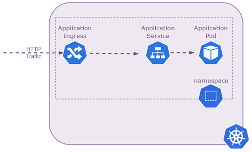
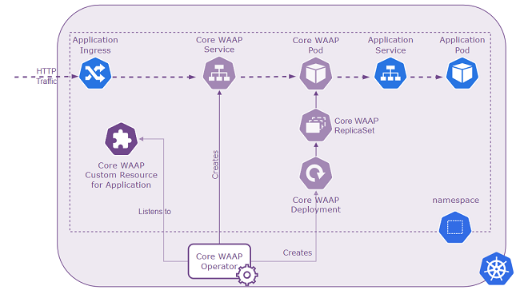

### Kubernetes basics (Ingress / Service / Pod)

Have a look at the Kubernetes Ingress / Service / Pod architecture:



> For this demo setup we are using a simple port-forward instead of an ingress resource.

### Setup USP Core WAAP instance

You will now setup a **USP Core WAAP instance** and access the petstore API via Core WAAP instead and test if you still can post invalid API calls to the backend application. The setup used will be slightly different in terms of traffic as it will be handled by USP Core WAAP which (acting as a reverse-proxy / WAF) will query the petstore API itself:



To make use of Core WAAP, the USP Core WAAP Operator has to be installed and running. This is out of scope for this lecture and therefore already prepared.

To check if the operator is running you can use the following command:

```shell
kubectl get pods \
  -n usp-core-waap-operator
```{{exec}}

The operator listens to resources of kind `corewaapservice`. As soon as such a **CustomResource** is configured, the operator creates the further required resources to run Core WAAP.
To check if a Core WAAP resource exists you can run:

```shell
kubectl get corewaapservices --all-namespaces
```{{exec}}

There are none yet and also there are no core-waap PODs yet (they all get the label 'app.kubernetes.io/name=usp-core-waap')

```shell
kubectl get pods \
  -l app.kubernetes.io/name=usp-core-waap \
  --all-namespaces
```{{exec}}

Now you can go ahead and change this in the next step as the USP Core WAAP Operator is ready you can configure a `CoreWaapService` now!
